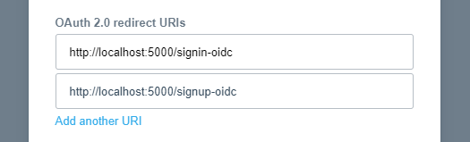

# Xero OAuth2 Sample

This is an example dotnet core MVC application making use of Xero sign in, and Xero API access using OAuth2.0.  
The use case of our app is to sign users in user Xero Sign In and retrieve and display counts of outstanding invoices for the users connected organisations.   
This sample is an extension of the [XeroSignInSample](../XeroSignInSample) for apps created to use PKCE.

**Pre-requisite**: 
- This sample is a .NET Core 3.1 application, so you'll need to install [.NET Core SDK 3.1 or above](https://dotnet.microsoft.com/download).
- You may want to read through Xero's [OAuth2.0 documentation](https://developer.xero.com/documentation/oauth2/overview) to familiarise yourself with the OAuth2.0 flow.

## Getting started with this sample.

1. [Create an OAuth2.0 app](https://developer.xero.com/documentation/oauth2/sign-in#createapp).
   - **Note**: When creating your app, be sure to select *Auth code with PKCE* as your OAuth 2.0 grant type.
   - **Note**: When creating your app, be sure to add two different redirect uris. You'll need one for `http://localhost:5000/signin-oidc` and one for `http://localhost:5000/signup-oidc` as the sample will run on port 5000 and bootstrap callback paths for `/signin-oidc` and `/signup-oidc`.  
   
2. Update the [appsettings.json](XeroOAuth2Sample-MVC-PKCE/appsettings.json) file to include your ClientId.
3. Run the sample from the command line in the [xero-netstandard-oauth2-samples\XeroOAuth2Sample-MVC-PKCE\XeroOAuth2Sample-MVC-PKCE](XeroOAuth2Sample-MVC-PKCE) directory using the command `dotnet run`, or using your favorite IDE.

## Ok, cool! How does it work though?

### Setting up authentication with Xero as your auth provider.

The bulk of the authentication settings are set up in the [Startup.cs](XeroOAuth2Sample-MVC-PKCE/Startup.cs) file.

Looking at the *ConfigureServices* method of the `Startup` class, you'll find a section of code for adding how this sample should be secured. In the [XeroSignInSample](../XeroSignInSample) there was only one challenge scheme for authenticating our users - *XeroSignIn*. In this sample we've added a second one - *XeroSignUp*.  

1. Before we get to that though, we've got to register some classes and services as dependencies into dependency injection.  

```
services.AddHttpClient();

services.TryAddSingleton(new XeroConfiguration
{
    ClientId = Configuration["Xero:ClientId"],
    ClientSecret = Configuration["Xero:ClientSecret"]
});

services.TryAddSingleton<IXeroClient, XeroClient>();
services.TryAddSingleton<IAccountingApi, AccountingApi>();
services.TryAddSingleton<MemoryTokenStore>();
```

`services.AddHttpClient` registers an instantiation of `IHttpClientFactory`, which along with the `XeroConfiguration` singleton, are constructor parameters for the `XeroClient` instantiation of `IXeroClient`.  
The `XeroClient` and `AccountingApi` classes interface with the Xero API via OAuth2.0 and OIDC. Both of which are provided via Nuget packages: [Xero.NetStandard.OAuth2Client](https://www.nuget.org/packages/Xero.NetStandard.OAuth2Client) and [Xero.NetStandard.OAuth2](https://www.nuget.org/packages/Xero.NetStandard.OAuth2) respectively.  
The `MemoryTokenStore` singleton is just a very simple token store using an in memory dictionary as token storage. It will be used to store access/refresh tokens against Xero UserIds to be used when retrieving data from Xero's API. The implementation of `MemoryTokenStore` can be found [here](XeroOAuth2Sample-MVC-PKCE/Example/MemoryTokenStore.cs).

2. Now, we'll look at how authentication is implemented for this sample.  
Firstly we're stating that we want to use cookies as our default authentication scheme, and naming the challenge scheme (*"XeroSignIn"*) that we'd like to use as our default challenge scheme. You'll see this challenge scheme (along with the *XeroSignUp* challenge scheme) implemented in the next section of code, along with an explanation of the differences between the two. We've chosen the *XeroSignIn* challenge scheme as the default because our users are more likely to want to sign into our app rather than sign up new connections when revisiting our app.

```
services.AddAuthentication(options =>
{
    options.DefaultScheme = CookieAuthenticationDefaults.AuthenticationScheme;
    options.DefaultChallengeScheme = "XeroSignIn";
})
.AddCookie(options =>
{
    options.Cookie.Name = "XeroIdentity";
})
```

3. Next we outline the implementation of our challenge schemes.  
This section is where your OAuth2.0 client details, and requested scopes are being set, along with some other required OpenID Connect parameters. It's also where we're stating that we'd like to use "https://identity.xero.com" as our auth provider.  

The only noticeable differences between the two schemes we're setting up are their names, the callback paths, and the scopes that are being requested.  
`openid`, `profile`, and `email` are all scopes that when granted, will allow your app access details about the user's identity. `accounting.settings`, and `accounting.transactions` are scopes that when asked for, will prompt a user to connect an organisation to your application. When granted, these scopes will allow your app to access subsets of the organisation's data on behalf of the logged in user. Finally the `offline_access` scope allows your app to receive a refresh token on successful login. More details on these scopes can be found in Xero's [scopes documentation](https://developer.xero.com/documentation/oauth2/scopes)  

Both schemes also make use of `options.UsePkce = true`. This, along with the exclusion of a client secret are the only differences to the non-PKCE [XeroOAuth2Sample](../XeroOAuth2Sample) app. All the hard work implementing PKCE is handled for us by the `Microsoft.AspNetCore.Authentication.OpenIdConnect` library provided by Microsoft. Thanks Microsoft!

```
.AddOpenIdConnect("XeroSignIn", options =>
{
    options.Authority = "https://identity.xero.com";

    options.UsePkce = true;
    options.ClientId = Configuration["Xero:ClientId"];
    
    options.ResponseType = "code";

    options.Scope.Clear();
    options.Scope.Add("openid");
    options.Scope.Add("profile");
    options.Scope.Add("email");

    options.CallbackPath = "/signin-oidc";

    options.Events = new OpenIdConnectEvents
    {
        OnTokenValidated = OnTokenValidated()
    };
})
.AddOpenIdConnect("XeroSignUp", options =>
{
    options.Authority = "https://identity.xero.com";

    options.UsePkce = true;
    options.ClientId = Configuration["Xero:ClientId"];
    
    options.ResponseType = "code";

    options.Scope.Clear();
    options.Scope.Add("offline_access");
    options.Scope.Add("openid");
    options.Scope.Add("profile");
    options.Scope.Add("email");
    options.Scope.Add("accounting.settings");
    options.Scope.Add("accounting.transactions");

    options.CallbackPath = "/signup-oidc";

    options.Events = new OpenIdConnectEvents
    {
        OnTokenValidated = OnTokenValidated()
    };
});
```

You may have also noticed that we're defining a function to be run when tokens are successfully validated. We're using this event to save access/refresh tokens, along with the access token's expiry time, into our token store for the user that has just successfully signed in/up. Below you'll find the implementation of our `OnTokenValidated` function.

```
private static Func<TokenValidatedContext, Task> OnTokenValidated()
{
    return context =>
    {
        var tokenStore = context.HttpContext.RequestServices.GetService<MemoryTokenStore>();

        var token = new XeroOAuth2Token
        {
            AccessToken = context.TokenEndpointResponse.AccessToken,
            RefreshToken = context.TokenEndpointResponse.RefreshToken,
            ExpiresAtUtc = DateTime.UtcNow.AddSeconds(Convert.ToDouble(context.TokenEndpointResponse.ExpiresIn))
        };

        tokenStore.SetToken(context.Principal.XeroUserId(), token);

        return Task.CompletedTask;
    };
}
```

### Enforcing the authentication.

Now that we've configured how we want our users to be authenticated, we've got to enable and enforce it.

Looking at the *configure* method in the same `Startup` class, you'll see the following line of code. **Note**: it's important that these lines of code exist in this order between the `UseRouting` and `UseEndpoints` lines so that the request pipeline can enforce authentication prior to routing the requests to your controllers.

```
app.UseAuthentication();
```

Looking at the *OutstandingInvoices* route on our [HomeController](XeroOAuth2Sample-MVC-PKCE/Controllers/HomeController.cs), you'll see that we've set the route to require authorized users using the `Authorize` attribute. This route does not care which scheme (*XeroSgnIn*/*XeroSignUp*) was used when a user was previously authenticated, and will use the default scheme (which you'll remember we set earlier) to authenticate the user if the user is not authenticated.

```
[Authorize]
public async Task<IActionResult> OutstandingInvoices()
...
```

This is different to our *SignUp* and *SignIn* routes, both of which define the specific schemes a user must be authenticated with in our to access the routes

```
[Authorize(AuthenticationSchemes = "XeroSignUp")]
public IActionResult SignUp()
...

```

```
[Authorize(AuthenticationSchemes = "XeroSignIn")]
public IActionResult SignIn()
...
```

### Adding "Sign in with Xero" and "Sign up with Xero" buttons.
You may have noticed that in the `HomeController` we've left the *Index* route as a non-secure route. We've done this so that we can use this route to present the user with "[Sign in with Xero](https://developer.xero.com/documentation/oauth2/sign-in#signinbutton)" and "[Sign up with Xero](https://developer.xero.com/documentation/oauth2/sign-in#signinbutton)" buttons.  
Looking at the [home/index](XeroOAuth2Sample-MVC-PKCE/Views/Home/Index.cshtml) view, you'll find that we've done this by including two of Xero's pre-built sign in/up buttons. The `data-href` attributes in each are linking to our secure routes from earlier to kick off the respective signin/signup flow.
```
<span data-xero-sso data-href="/home/signin" data-label="Sign in with Xero"></span>
<span data-xero-sso data-href="/home/signup" data-label="Sign up with Xero"></span>
<script src="https://edge.xero.com/platform/sso/xero-sso.js"></script>
```

### Using the Xero API with OAuth2.0
So, we've got an authenticated user, which means we've got an access token that can be used against Xero's API. But how do we use it?

1. The first thing you're going to want to do is check which tenants have been connected to our app for the authenticated user.  
Looking again at the *OutstandingInvoices* route on our [HomeController](XeroOAuth2Sample-MVC-PKCE/Controllers/HomeController.cs) you'll see us retrieve the access token for the user from our token store, and use it to retrieve the connections between the user and our app. We also redirect to a separate page prompting the user to add an organisation if they've signed into the app but never connected an organisation.

```
var token = await _tokenStore.GetAccessTokenAsync(User.XeroUserId());

var connections = await _xeroClient.GetConnectionsAsync(token);

if (!connections.Any())
{
    return RedirectToAction("NoTenants");
}
```

2. If our users do have some connected organisations, we'll loop through them, retrieving the connected organisation's details from Xero's Organisation endpoint, as well as the invoices from Xero's Invoice endpoint, filtered only to the organisation's outstanding invoices.
```
var data = new Dictionary<string, int>();

foreach (var connection in connections)
{
    var accessToken = token.AccessToken;
    var tenantId = connection.TenantId.ToString();

    var organisations = await _accountingApi.GetOrganisationsAsync(accessToken, tenantId);
    var organisationName = organisations._Organisations[0].Name;

    var outstandingInvoices = await _accountingApi.GetInvoicesAsync(accessToken, tenantId, statuses: "AUTHORISED", where: "Type == \"ACCREC\"");

    data[organisationName] = outstandingInvoices._Invoices.Count;
}
```

We then build a model to hold this data and present the user with our OutstandingInvoices view.

```
var model = new OutstandingInvoicesViewModel
{
    Name = $"{User.FindFirstValue(ClaimTypes.GivenName)} {User.FindFirstValue(ClaimTypes.Surname)}",
    Data = data
};

return View(model);
```

## That's it!
1. Browsing to the root of the site will present the Xero sign in and Xero sign up buttons.
2. Clicking the Xero sign in or Xero sign up buttons route the user to our specific secure routes.
3. Microsoft's OIDC implementation kicks in and takes the user through the Xero sign in process.
   1. The user is taken through the Xero sign in process, granting user consent to your app if it's their first time.
      1. The user is also prompted to connect an organisation if you've asked for organisation specific scopes.
   2. The entire OIDC flow is handled for you. No need to swap authorisation codes for access/id/refresh tokens or manage code verifiers/challenges for PKCE.
   3. The User Principal is set, including all the claims attached to the id token provided by Xero.
   4. Our OnTokenValidated event stores the users access token so it can later be used to access Xero's API.
4. Connections for the user are retrieved using the Connections endpoint and the users access token.
5. Organisation data is retrieved on behalf of the user using their access token, and tenant id from each connection.
6. The user is displayed our secure page with details on their connected organisation's outstanding invoices.
