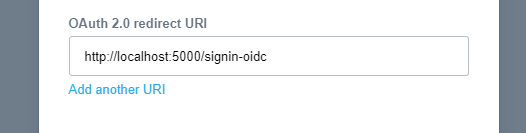

# XeroSignInSample

This is an example dotnet core MVC application making use of Xero sign in.  
This sample does not include using OAuth2.0 to make requests against Xero's public API.

**Pre-requisite**: 
- This sample is a .NET Core 2.2 application, so you'll need to install [.NET Core SDK 2.2 or above](https://dotnet.microsoft.com/download).

## Getting started with this sample.

1. [Create an OAuth2.0 app](https://developer.xero.com/documentation/oauth2/sign-in#createapp).
   - **Note**: When creating your app, be sure to add a redirect uri for `http://localhost:5000/signin-oidc` as the sample will run on port 5000 and bootstrap a callback path for `/signin-oidc`.  
   
2. Update the [appsettings.json](XeroSignInSample/appsettings.json) file to include your ClientId and ClientSecret.
3. Run the sample from the command line in the [XeroSignInSample-DotNetCore/XeroSignInSample/XeroSignInSample](XeroSignInSample) directory using the command `dotnet run`, or using your favorite IDE.

## Ok, cool! How does it work though?

### Setting up authentication with Xero as your auth provider.

The bulk of the authentication settings are set up in the [Startup.cs](XeroSignInSample/Startup.cs) file.

Looking at the *ConfigureServices* method of the `Startup` class, you'll find a section of code for adding how this sample should be secured.  

1. We start by stating that we want to use cookies as our default authentication scheme, and naming the challenge the scheme ("XeroSignIn") that we'd like to use. You'll see this challenge scheme implemented in the next section of code.
```
services.AddAuthentication(options =>
{
    options.DefaultScheme = CookieAuthenticationDefaults.AuthenticationScheme;
    options.DefaultChallengeScheme = "XeroSignIn";
})
.AddCookie(options =>
{
    options.Cookie.Name = "XeroIdentity";
})
```
2. Next we outline the implementation of our "XeroSignIn" challenge scheme.  
This section is where your OAuth2.0 client details, and requested scopes are being set, along with some other required OpenID Connect parameters. It's also where we're stating that we'd like to use "https://identity.xero.com" as our auth provider.
```
.AddOpenIdConnect("XeroSignIn", options =>
{
    options.Authority = "https://identity.xero.com";

    options.ClientId = Configuration["Xero:ClientId"];
    options.ClientSecret = Configuration["Xero:ClientSecret"];

    options.ResponseType = "code";

    options.Scope.Clear();
    options.Scope.Add("openid");
    options.Scope.Add("profile");
    options.Scope.Add("email");

    options.CallbackPath = "/signin-oidc";
});
```

### Enforcing the authentication.

Now that we've configured how we want our users to be authenticated, we've got to enable and enforce it.

Looking at the *configure* method in the same `Startup` class, you'll see the following line of code. **Note**: it's important that this line of code exists before the `UseMvc` line so that the request pipeline can enforce authentication prior to routing the requests to your controllers.
```
app.UseAuthentication();
```

Looking at the *Hello* route on our [HomeController](XeroSignInSample/Controllers/HomeController.cs), you'll see that we've set the route to require authorized users using the `Authorize` attribute.
```
[Authorize]
public IActionResult Hello()
...
```

### Adding a "Sign in with Xero" button.
You may have noticed that in the `HomeController` we've left the *Index* route as a non-secure route. We've done this so that we can use this route to present the user with a "[Sign in with Xero](https://developer.xero.com/documentation/oauth2/sign-in#signinbutton)" button.  
Looking at the [home/index](XeroSignInSample/Views/Home/Index.cshtml) view, you'll find that we've done this by including Xero's pre-built sign in Xero button. The `data-href` attribute is linking to our secure route from earlier to kick off the OIDC signin flow.
```
<span data-xero-sso data-href="/home/hello" data-label="Sign in with Xero"></span>
<script src="https://edge.xero.com/platform/sso/xero-sso.js"></script>
```

## That's it!
1. Browsing to the root of the site will present the Xero sign in button.
2. Clicking the Xero sign in button routes the user to our secure route.
3. Microsoft's OIDC implementation kicks in and takes the user through the Xero sign in process.
   1. The user is taken through the Xero sign in process, granting user consent to your app if it's their first time.
   2. The entire OIDC flow is handled for you. No need to swap authorisation codes for access/id tokens.
   3. The User Principal is set, including all the claims attached to the id token provided by Xero.
4. The secure route's view is displayed upon successful sign in.
